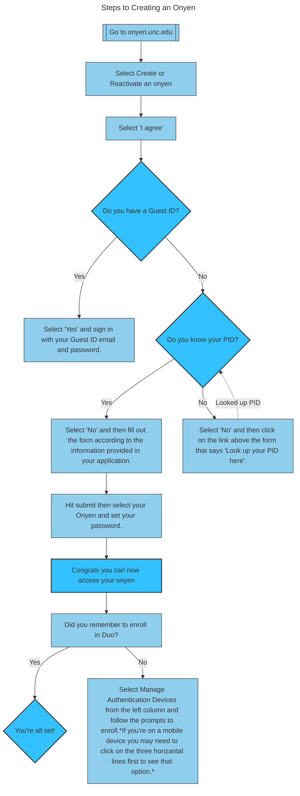

# Mermaid Diagrams

### Description 
The Diagram above details a highly used process that I often come accross working. Students, faculty, and staff frequently have questions about creating or reactivating their onyen. For this particular process the steps are universal, meaning everyone uses them regardless of their status with the university.  

I placed important questions in the larger diamond shapes. These are questions regarding important piece of information that are absolutely necessary to complete the process.